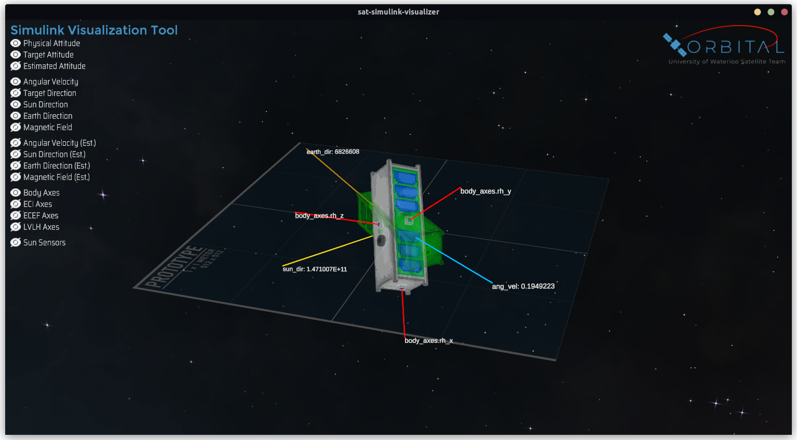
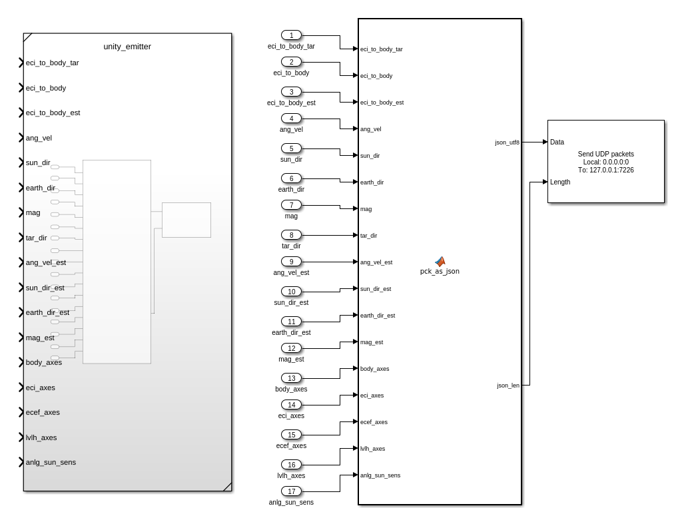

# Satellite Simulink Visualizer

*Note that given the large size of this Unity project, only the documentation and Simulink subsystem are found on this repository. Please see the external UW Orbital Google Drive folder for a compressed archive of this folder with the Unity project files and precompiled executables.*

[Google Drive - Satelite Simulink Visualizer](https://drive.google.com/drive/folders/1wCWz0c6XM63PRThDQJDoa5u3kjOa-6ai?usp=sharing)

## Overview

This is a tool intended for use with the estimation and control efforts of team members of UW Orbital. This tool features a full 3D animation of a mock CubeSat approximately of the same size as the proposed CSDC CubeSat and accepts data from Simulink.

The image above has most inputs disabled but shows various vectors in the chosen Earth-centered reference frame (ECI). Target attitude and the current estimated attitude (when enabled) are transparent and the models are smaller than the current physical model.

Dynamics and control/estimation algorithms are performed in Simulink and the data is packaged using JSON and trasnmitted to Unity via UDP packages sent over loopback. Port 7226 is currently configured in Unity and Simulink. If this must be configured, it can be directly changed in Simulink but rebuilds of the Unity project are necessary.

THe image above shows the unity_emitter subsystem (present in unity_emitter.slx). The subsystem, on the left, encompasses the blocks on the right. Outputs can be connected to the subsystem and will be forwarded over UDP. **If no input is connected, when the simulation is run these unconnected inputs will be output in the JSON data will be populated by 0.**

This block can be added to a given Simulink model by using unity_emitter.slx as a referenced subsystem.

If attempting to run the simulation at a specific pacing and Unity renderer framerate, it is necessary to modify the UDP sender block's sampling time. Double click on this block in the subsystem and a Block Parameters dialog will open. Adjust the Sample Time field from -1 to <simulink-pacing>/<desired-renderer-fps>.

## Block Inputs

To render properly, the following inputs must adhere to the format presented in the following table. Note that the Earth-Centered Inertial (ECI) reference frame is chosen as the base axes of the system for convenience and familiarity. However, the origin is presented as being on the satellite itself as opposed to the center of the Earth.

| Input Name | Description | Format |
|---|---|---|
| eci_to_body_tar | Attitude quaternion of satellite target (commanded) attitude | 4-value array (scalar, x, y, z) |
| eci_to_body | Attitude quaternion of physical satellite attitude | 4-value array (scalar, x, y, z) |
| eci_to_body_est | Attitude quaternion of estimated physical satellite attitude | 4-value array (scalar, x, y, z) |
| ang_vel | Angular velocity vector (in ECI) of physical satellite | 3-value vector (x, y, z) |
| sun_dir | Position vector (in ECI) from satellite to the sun | 3-value vector (x, y, z)|
| earth_dir | Position vector (in ECI) from satellite to the centre of the Earth | 3-value vector (x, y, z) |
| mag | Magnetic field vector (in ECI) due to Earth | 3-value vector (x, y, z) |
| tar_dir | Position vector (in ECI) from satellite to an arbitrary target | 3-value vector (x, y, z) |
| ang_vel_est | Estimated angular velocity vector (in ECI) of physical satellite | 3-value vector (x, y, z) |
| sun_dir_est | Estimated position vector (in ECI) from satellite to the sun | 3-value vector (x, y, z) |
| earth_dir_est | Estimated position vector (in ECI) from satellite to the centre fo the Earth | 3-value vector (x, y, z) |
| mag_est | Estimated magnetic field vector (in ECI) due to Earth | 3-value vector (x, y, z) |
| body_axes | Body axes (3 unit vectors in ECI) of the physical satellite | 9-value array (3 3-value vectors) |
| eci_axes | ECI reference frame axes (3 unit vectors in ECI). Ideally these would be provided as constant values: [ 1 0 0 0 1 0 0 0 1 ] | 9-value array (3 3-value vectors) |
| ecef_axes | ECEF reference frame axes (3 unit vectors in ECI) | 9-value array (3 3-value vectors) |
| lvlh_axes | LVLH reference frame axes (3 unit vectors in ECI) | 9-value array (3 3-value vectors) |
| anlg_sun_sens | Analog sun sensor readouts for each face of satellite. Provide in the following order: positive x, negative x, positive y, negative y, positive z, negative z | 6-value array |

## Builds

Various builds for Linux, Mac, and Windows can be found in the build folder. Only the Linux build has been tested on Ubuntu 22.04.

## Contributors

Written by Samuel Street.

## Attributions

Uicons by <a href=https://www.flaticon.com/uicons>Flaticon</a>. Note that colors have been inverted to make eye icons white
